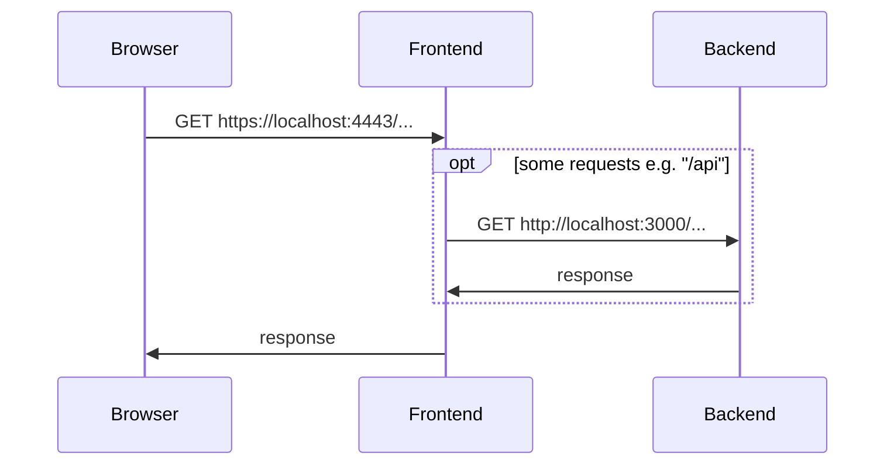

# Contributing to Transfer to Ladok

## Install Node and npm

- Ensure you have the latest LTS version of Node (16.x) installed by executing `node --version`
- Ensure you have the latest major version of NPM (8.x) installed by executing `npm --version`

## Clone and install all the dependencies

- Clone the Transfer to Ladok repository or a forked version of it

- Install repo-wide dependencies.

  ```sh
  npm install
  ```

- Setup each of the packages in the monorepo

  ```sh
  npm run bootstrap
  ```

## Try to run Transfer to Ladok in development mode

The following script spins up frontend and backend in the same terminal with interlaced logs which can be a lot of them :)

```sh
npm run dev
```

When running the command above, you will get the following message:

```
t2l-backend: [10:06:49.215] FATAL: Missing required environmental variable CANVAS_API_URL {"app":"transfer-to-ladok"}
t2l-backend:     err: {
t2l-backend:       "type": "Error",
t2l-backend:       "message": "Missing required environmental variable CANVAS_API_URL",
t2l-backend:       "stack":
t2l-backend:           Error: Missing required environmental variable CANVAS_API_URL
t2l-backend:               at throwIfMissing (/transfer-to-ladok/packages/t2l-backend/node_modules/@kth/reqvars/index.js:7:11)
t2l-backend:               at Object.check (/transfer-to-ladok/packages/t2l-backend/node_modules/@kth/reqvars/index.js:23:7)
t2l-backend:               at Object.<anonymous> (/transfer-to-ladok/packages/t2l-backend/src/config/file:/transfer-to-ladok/packages/t2l-backend/src/config/start.ts:35:25)
t2l-backend:               at Module._compile (node:internal/modules/cjs/loader:1105:14)
t2l-backend:               at Module._compile (/transfer-to-ladok/packages/t2l-backend/node_modules/source-map-support/source-map-support.js:568:25)
t2l-backend:               at Module.m._compile (/private/var/folders/fr/bhdyvgvn6tgckfbkw_b85jmm0000gn/T/ts-node-dev-hook-11665952118302458.js:69:33)
t2l-backend:               at Module._extensions..js (node:internal/modules/cjs/loader:1159:10)
t2l-backend:               at require.extensions..jsx.require.extensions..js (/private/var/folders/fr/bhdyvgvn6tgckfbkw_b85jmm0000gn/T/ts-node-dev-hook-11665952118302458.js:114:20)
t2l-backend:               at require.extensions.<computed> (/private/var/folders/fr/bhdyvgvn6tgckfbkw_b85jmm0000gn/T/ts-node-dev-hook-11665952118302458.js:71:20)
t2l-backend:               at Object.nodeDevHook [as .ts] (/transfer-to-ladok/packages/t2l-backend/node_modules/ts-node-dev/lib/hook.js:63:13)
t2l-backend:     }
```

## Create a `.env` file for backend

- Copy `packages/t2l-backend/.env.in` to `packages/t2l-backend/.env`
- Open the newly created file and put all the required variables.

---

# Understand what is going on

> **ℹ️ Note**. This explanation applies only to **development**, not production

When you run `npm run dev`, it will run the `dev` script in both backend and frontend.

- Backend: it will start a HTTP server on port 3000.
- Frontend: it will start a HTTPS server on port 4443. Some requests will be proxied to the backend.


