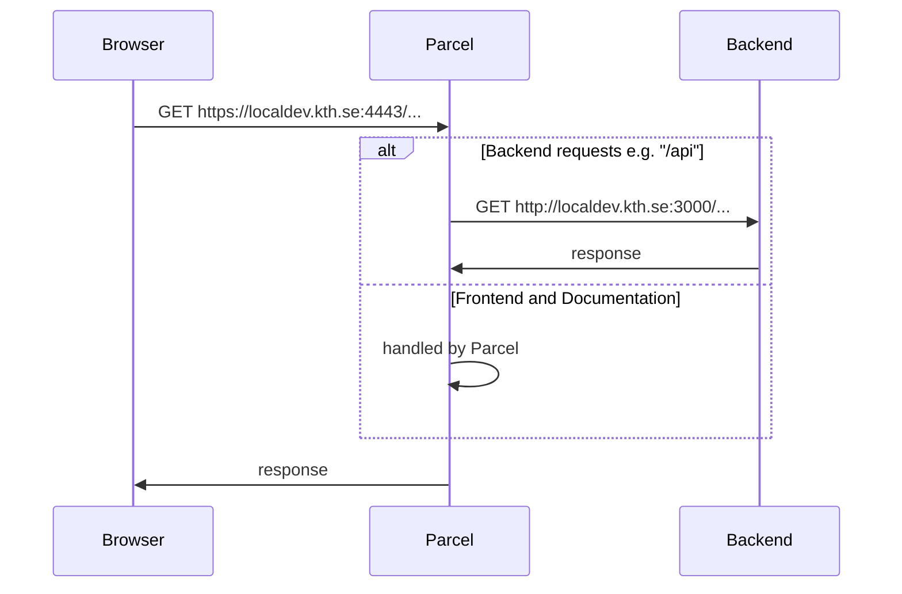

# Transfer to Ladok

Application to read grades from Canvas and write them to Ladok

# Getting started

Here you will start Transfer to Ladok in development mode.

> **ℹ️ Note**. The entire documentation assumes that in your machine, domain `localdev.kth.se` maps to `localhost`

## Install Node and npm

- Ensure you have the latest LTS version of Node (16.x) installed by executing `node --version`
- Ensure you have the latest major version of NPM (8.x) installed by executing `npm --version`

## Clone and install all the dependencies

- Clone the Transfer to Ladok repository or a forked version of it

- Install repo-wide dependencies.

  ```sh
  npm install
  ```

- Install all the dependencies in all the packages and link them each other

  ```sh
  npm run bootstrap
  ```

## Try to run Transfer to Ladok in development mode

The following script spins up frontend and backend in the same terminal with interlaced logs which can be a lot of them :)

```sh
npm run dev
```

Now you can go the following paths:

- Transfer to Ladok, the frontend: https://localdev.kth.se:4443/transfer-to-ladok/index.html
- The API documentation: https://localdev.kth.se:4443/transfer-to-ladok/docs/index.html

---

When running the command above, you will see the following message in your terminal:

```
t2l-backend: [10:06:49.215] FATAL: Missing required environmental variable CANVAS_API_URL {"app":"transfer-to-ladok"}
t2l-backend:     err: {
t2l-backend:       "type": "Error",
t2l-backend:       "message": "Missing required environmental variable CANVAS_API_URL",
t2l-backend:       "stack":
t2l-backend:           Error: Missing required environmental variable CANVAS_API_URL
t2l-backend:               at throwIfMissing (/transfer-to-ladok/packages/t2l-backend/node_modules/@kth/reqvars/index.js:7:11)
t2l-backend:               at Object.check (/transfer-to-ladok/packages/t2l-backend/node_modules/@kth/reqvars/index.js:23:7)
t2l-backend:              ...
t2l-backend:     }
```

Next steps:

- If you only want to develop the frontend without setting up a real backend, go to [./packages/t2l-frontend](./packages/t2l-frontend/README.md)
- If you want a full functioning backend, Start from [./packages/t2l-backend](./packages/t2l-backend/README.md)

---

# Concepts

This part explains different concepts in this repository. Note that explanations are given for things that affect the entire repository, not each part in particular.

## Understanding dev mode

When you run `npm run dev`, it will run the `dev` script in both backend and frontend.

- Backend: it will start a **Express HTTP server** on port 3000.
- Frontend: it will start a **Parcel HTTPS server** on port 4443. Some requests will be proxied to the backend; others will be handled by the Parcel server itself

It means, all requests can be done to https://localdev.kth.se:4443



## Monorepo structure

This repository is a monorepo structured in this way:

- `packages/t2l-backend` is an Express server
- `packages/t2l-frontend` contains the code for the frontend
- `packages/t2l-scripts` contains diverse scripts that semi-automate workflows
